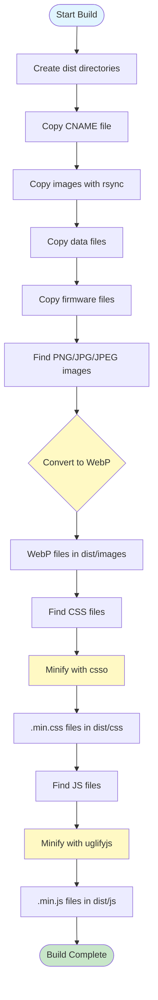
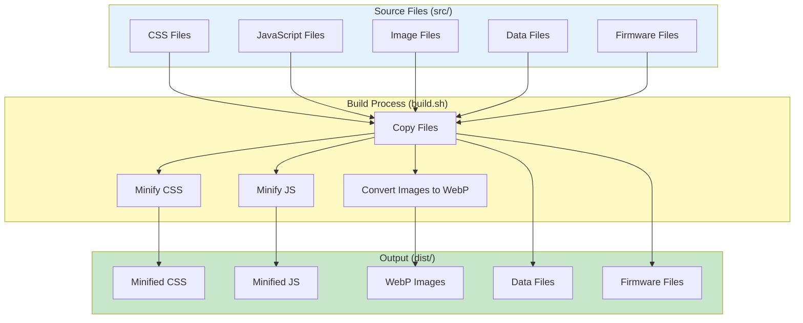

# Openterface_assets

Openterface_assets is a static asset management project for the Openterface website. It provides a comprehensive build pipeline for processing and optimizing web assets (images, CSS, JavaScript).

## Project Overview

This project serves as the asset repository and build system for the Openterface website. The main workflow transforms source assets from `src/` into optimized, production-ready files in `dist/` through a build process that:

- **Copies static files** (images, data, firmware) preserving folder structure
- **Converts images** to WebP format for better compression
- **Minifies CSS** files for reduced file size
- **Minifies JavaScript** files for optimized performance

Files in `src/` are served as static assets and don't require detailed explanation here.

## Project Structure

```
Openterface_assets/
├── src/                    # Source files (served as static assets)
│   ├── css/               # Stylesheets
│   ├── js/                # JavaScript files
│   ├── images/            # Image assets
│   ├── data/              # Data files
│   └── openterface/       # Firmware files
├── dist/                  # Build output directory (generated)
├── scripts/               # Utility scripts
│   ├── generate_image_links.py
│   ├── image_resizer.py
│   ├── update_youtube_csv.py
│   └── README_youtube_csv.md
└── build.sh               # Main build script
```

## Build Workflow

The build process transforms source assets into optimized, production-ready files. The `build.sh` script performs the following operations:

1. **Directory Setup**: Creates `dist/` directory structure
2. **File Copying**: Copies static files (images, data, firmware) preserving folder structure
3. **Image Conversion**: Converts PNG/JPG/JPEG images to WebP format for better compression
4. **CSS Minification**: Minifies CSS files using `csso`
5. **JavaScript Minification**: Minifies JS files using `uglifyjs`



**Requirements**: `cwebp`, `csso`, `uglifyjs`, `rsync`

**Usage**:
```bash
./build.sh
```

## Overall Project Architecture



## Dependencies

### Build Tools
- `cwebp` - WebP image converter
- `csso` - CSS minifier
- `uglifyjs` - JavaScript minifier
- `rsync` - File synchronization tool

### Node.js Dependencies
- `mermaid` (v11.12.2) - Diagram generation

### Python Dependencies
- `Pillow` - Image processing (for `scripts/image_resizer.py`)
- `requests` - HTTP library (for `scripts/update_youtube_csv.py`)

## Getting Started

### 1. Set Up Python Virtual Environment

The Python utility scripts in `scripts/` require a virtual environment:

```bash
# Create a virtual environment
python3 -m venv venv

# Activate the virtual environment
source venv/bin/activate

# Install Python dependencies
pip install -r requirements.txt
```

**Note**: Add `venv/` to `.gitignore` if it's not already there:
```bash
echo "venv/" >> .gitignore
```

### 2. Install Build Dependencies

The `build.sh` script requires Node.js tools and system utilities:

```bash
# macOS - Install webp tools (for cwebp)
brew install webp

# Install Node.js tools globally
npm install -g csso-cli uglify-js

# Or use your system's package manager for other platforms
```

**Note**: `rsync` is usually pre-installed on macOS and Linux systems.

### 3. Run the Build

Make the build script executable and run it:

```bash
# Make the script executable (if not already)
chmod +x build.sh

# Run the build script
./build.sh
```

### 4. Utility Scripts (Optional)

- Image management scripts are available in `scripts/` directory
- See `scripts/README_youtube_csv.md` for YouTube CSV management
- These scripts require the Python virtual environment to be activated

## Notes

- The `dist/` directory is generated by the build script and should not be edited directly
- SVG files are copied as-is (not converted to WebP)
- The build script preserves directory structure from `src/` to `dist/`
- Files in `src/` are served as static assets at `https://assets.openterface.com`