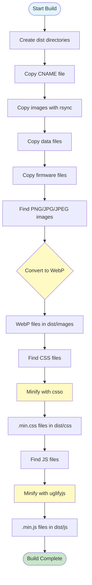
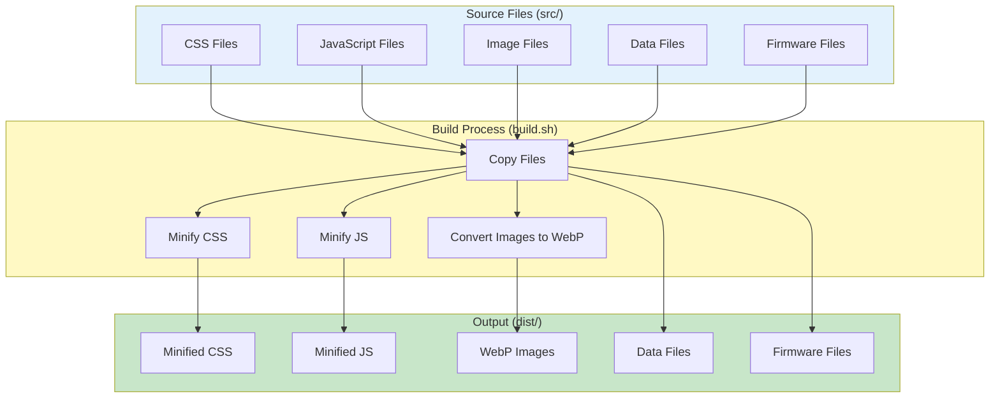

# Openterface_assets

Openterface_assets is a static asset management project for the Openterface website. It provides a comprehensive build pipeline for processing and optimizing web assets (images, CSS, JavaScript).

## Project Overview

This project serves as the asset repository and build system for the Openterface website. The main workflow transforms source assets from `src/` into optimized, production-ready files in `dist/` through a build process that:

- **Copies static files** (images, data, firmware) preserving folder structure
- **Converts images** to WebP format for better compression
- **Minifies CSS** files for reduced file size
- **Minifies JavaScript** files for optimized performance

Files in `src/` are served as static assets and don't require detailed explanation here.

## Project Structure

```
Openterface_assets/
├── src/                    # Source files (served as static assets)
│   ├── site/              # Asset browser UI (index.html, app.js, gate.js, styles.css)
│   ├── css/               # Stylesheets
│   ├── js/                # JavaScript files
│   ├── images/            # Image assets
│   ├── data/              # Data files
│   └── openterface/       # Firmware files
├── dist/                  # Build output directory (generated)
├── config.toml            # Base URL for manifest and link generation
├── scripts/               # Utility scripts
│   ├── generate_url.py
│   ├── generate_manifest.py
│   ├── image_resizer.py
│   ├── update_youtube_csv.py
│   └── README_youtube_csv.md
└── build.sh               # Main build script
```

## Build Workflow

The build process transforms source assets into optimized, production-ready files. The `build.sh` script performs the following operations:

1. **Directory Setup**: Creates `dist/` directory structure
2. **File Copying**: Copies static files (images, data, firmware) preserving folder structure
3. **Image Conversion**: Converts PNG/JPG/JPEG images to WebP format for better compression
4. **CSS Minification**: Minifies CSS files using `csso`
5. **JavaScript Minification**: Minifies JS files using `uglifyjs`
6. **Site copy**: Copies `src/site/` to `dist/` root for the asset browser


```mermaid
flowchart TD
    Start([Start Build]) --> CreateDirs[Create dist directories]
    CreateDirs --> CopyCNAME[Copy CNAME file]
    CopyCNAME --> CopyImages[Copy images with rsync]
    CopyImages --> CopyData[Copy data files]
    CopyData --> CopyFirmware[Copy firmware files]
    
    CopyFirmware --> FindImages[Find PNG/JPG/JPEG images]
    FindImages --> ConvertWebP{Convert to WebP}
    ConvertWebP --> WebPDone[WebP files in dist/images]
    
    WebPDone --> FindCSS[Find CSS files]
    FindCSS --> MinifyCSS[Minify with csso]
    MinifyCSS --> CSSDone[.min.css files in dist/css]
    
    CSSDone --> FindJS[Find JS files]
    FindJS --> MinifyJS[Minify with uglifyjs]
    MinifyJS --> JSDone[.min.js files in dist/js]
    
    JSDone --> End([Build Complete])
    
    style Start fill:#e1f5ff
    style End fill:#c8e6c9
    style ConvertWebP fill:#fff9c4
    style MinifyCSS fill:#fff9c4
    style MinifyJS fill:#fff9c4
```

**Requirements**: `cwebp`, `csso`, `uglifyjs`, `rsync`

**Usage**:
```bash
./build.sh
python scripts/generate_manifest.py

# Preview the asset browser locally
python -m http.server 8080 --directory dist
# Open http://localhost:8080/
```

## Asset Browser

The site at the repository root URL (`https://assets.openterface.com/` when deployed) is a read-only browser for everything in `dist/`:

- **Search** by filename, path, or folder (press `/` to focus the search box)
- **Filter** by category: Images, Data (including APKs), CSS, JavaScript, Markdown, Other
- **Copy** raw URL, markdown link, or markdown image syntax
- **Preview** images in a lightbox
- **View toggle** — **Comfortable** (default grid), **Compact** (denser grid), or **Masonry** (Pinterest-style columns sized by each image’s aspect ratio; preference saved in your browser)
- **Lazy loading** — thumbnails load as you scroll (all three views) via `IntersectionObserver`, with shimmer placeholders sized from manifest dimensions
- **Sort** — Name A–Z, **Newest first**, or **Oldest first** (uses last Git commit date per file in `src/` as the upload/update time)

The catalog is generated from built files (not `links/*.md`), so it always matches what GitHub Pages serves. Raster images with both JPEG/PNG and WebP variants appear once (WebP preferred).

## Access (password gate)

The asset browser homepage is protected by a **lightweight frontend gate** (shared team password). This only hides the browse UI from casual visitors—it is **not** strong security.

- **Remember on this device** is enabled by default: after entering the password once, your browser keeps access for **30 days** (`localStorage`).
- Uncheck “Remember on this device” to require the password again when the browser session ends (`sessionStorage` only).
- Use **Log out** in the header to clear stored access on shared machines.

**Still public without the password:**

- Direct CDN URLs (`/images/...`, `/data/...`, etc.)
- `https://assets.openterface.com/assets.json`
- All files in this public GitHub repository

Do not rely on this gate to protect confidential assets; use private hosting if you need real access control.

## Overall Project Architecture


```mermaid
graph TB
    subgraph Source["Source Files (src/)"]
        CSS[CSS Files]
        JS[JavaScript Files]
        Images[Image Files]
        Data[Data Files]
        Firmware[Firmware Files]
    end
    
    subgraph Build["Build Process (build.sh)"]
        Copy[Copy Files]
        Convert[Convert Images to WebP]
        MinifyCSS[Minify CSS]
        MinifyJS[Minify JS]
    end
    
    subgraph Output["Output (dist/)"]
        DistCSS[Minified CSS]
        DistJS[Minified JS]
        DistImages[WebP Images]
        DistData[Data Files]
        DistFirmware[Firmware Files]
    end
    
    CSS --> Copy
    JS --> Copy
    Images --> Copy
    Data --> Copy
    Firmware --> Copy
    
    Copy --> Convert
    Copy --> MinifyCSS
    Copy --> MinifyJS
    
    Convert --> DistImages
    MinifyCSS --> DistCSS
    MinifyJS --> DistJS
    Copy --> DistData
    Copy --> DistFirmware
    
    style Source fill:#e3f2fd
    style Build fill:#fff9c4
    style Output fill:#c8e6c9
```

## Dependencies

### Build Tools
- `cwebp` - WebP image converter
- `csso` - CSS minifier
- `uglifyjs` - JavaScript minifier
- `rsync` - File synchronization tool

### Node.js Dependencies
- `mermaid` (v11.12.2) - Diagram generation

### Python Dependencies
- `Pillow` - Image processing (for `scripts/image_resizer.py`)
- `requests` - HTTP library (for `scripts/update_youtube_csv.py`)

## Getting Started

### 1. Set Up Python Virtual Environment

The Python utility scripts in `scripts/` require a virtual environment:

```bash
# Create a virtual environment
python3 -m venv venv

# Activate the virtual environment
source venv/bin/activate

# Install Python dependencies
pip install -r requirements.txt
```

**Note**: Add `venv/` to `.gitignore` if it's not already there:
```bash
echo "venv/" >> .gitignore
```

### 2. Install Build Dependencies

The `build.sh` script requires Node.js tools and system utilities:

```bash
# macOS - Install webp tools (for cwebp)
brew install webp

# Install Node.js tools globally
npm install -g csso-cli uglify-js

# Or use your system's package manager for other platforms
```

**Note**: `rsync` is usually pre-installed on macOS and Linux systems.

### 3. Run the Build

Make the build script executable and run it:

```bash
# Make the script executable (if not already)
chmod +x build.sh

# Run the build script
./build.sh
```

### 4. Utility Scripts (Optional)

- Image management scripts are available in `scripts/` directory
- See `scripts/README_youtube_csv.md` for YouTube CSV management
- These scripts require the Python virtual environment to be activated

## Notes

- The `dist/` directory is generated by the build script and should not be edited directly
- SVG files are copied as-is (not converted to WebP)
- The build script preserves directory structure from `src/` to `dist/`
- Files in `src/` are served as static assets at `https://assets.openterface.com`